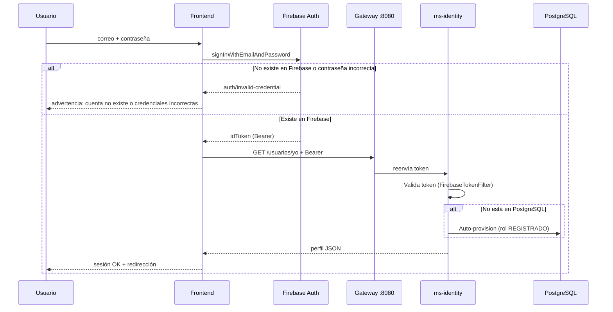
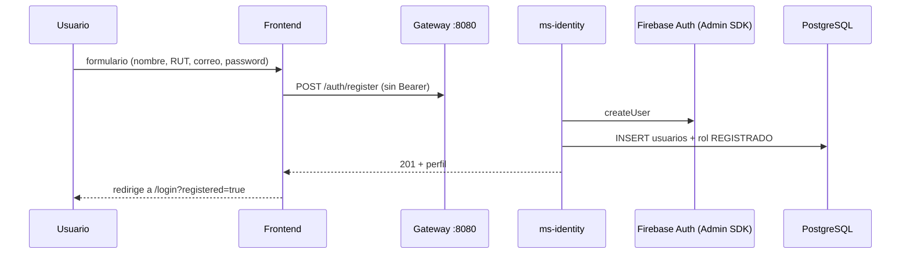

# Flujo de autenticación — Firebase + PostgreSQL (ms-identity)

> **Módulo:** `frontend-info` + `ms-identity`  
> **Actualizado:** 2026-06-06  
> **Código:** `src/services/auth.service.ts`, `src/app/login/page.tsx`, `src/app/register/page.tsx`  
> **Backend:** `FirebaseTokenFilter`, `POST /auth/register`, `GET /usuarios/yo`

## Principio

Firebase Auth es la **fuente de identidad** (correo + contraseña). PostgreSQL (`catastrofecl.usuarios`) guarda el **perfil de negocio** (roles, permisos, documento).  
Los dos sistemas **no se sincronizan solos**: el proyecto los alinea con registro unificado o auto-provision en login.

| Sistema | Qué guarda |
|---------|------------|
| Firebase Auth | Credenciales, `uid`, email |
| PostgreSQL | Perfil, roles, permisos, RUT/documento |

**Gateway:** el frontend siempre llama `http://localhost:8080` (`NEXT_PUBLIC_API_URL`).

---

## Flujo A — Login (cuenta ya en Firebase)

Usuario que **ya existe en Firebase** (consola, registro previo, etc.) entra por **Iniciar sesión**.



### Pasos

| # | Acción | Resultado |
|---|--------|-----------|
| 1 | Firebase valida correo + contraseña | Si falla → **no se crea nada**; mensaje al usuario |
| 2 | Front obtiene `idToken` | Token Bearer para el gateway |
| 3 | `GET /usuarios/yo` vía gateway | `ms-identity` valida el token |
| 4 | Auto-provision (si falta en BD) | `FirebaseTokenFilter` crea fila en `usuarios` |
| 5 | Respuesta con perfil | Login completo; datos en localStorage |

### Mensajes en UI (login)

| Caso | Mensaje |
|------|---------|
| Cuenta no existe / contraseña incorrecta | *No existe una cuenta con ese correo y contraseña en Firebase. Verifica tus datos o créala en Registrarse.* |
| Error de sesión backend | Detalle RFC 7807 o mensaje genérico de validación |

### Importante

- El **login no crea** cuentas en Firebase.
- El **login sí puede crear** la fila en PostgreSQL si Firebase es válido pero la BD estaba vacía (p. ej. tras borrar usuarios o cuenta creada solo en consola Firebase).

---

## Flujo B — Registro desde el Frontend (`/register`)

Usuario **nuevo** completa el formulario en **Registrarse**.



### Pasos

| # | Acción | Resultado |
|---|--------|-----------|
| 1 | `POST /auth/register` | Un solo endpoint; sin token previo |
| 2 | Backend crea usuario en **Firebase** | Admin SDK |
| 3 | Backend persiste en **PostgreSQL** | Misma transacción de negocio |
| 4 | Correo ya en Firebase | Backend recupera UID y **sincroniza** en BD (no duplica) |

### Resultado esperado

Tras registro exitoso, el usuario debe existir en:

- Firebase Authentication (consola)
- Tabla `usuarios` en `catastrofecl`

```sql
SELECT correo, firebase_uid, nombres FROM usuarios ORDER BY creado_en DESC;
```

### Código frontend

- `AuthService.register()` → `registerHttp.post('/auth/register', …)`  
- **No** usa el flujo legacy `createUserWithEmailAndPassword` + `sync` del cliente.

---

## Tabla resumen

| Acción | Firebase | PostgreSQL local |
|--------|----------|------------------|
| **Registrarse** (front) | Crea / reutiliza | Crea / sincroniza |
| **Iniciar sesión** (existe en Firebase) | Valida | Crea si faltaba (auto-sync) |
| **Iniciar sesión** (no existe en Firebase) | Rechaza | No modifica BD |
| **Crear en consola Firebase** | Existe | Se crea al **primer login** |

---

## Sincronización automática (backend)

Implementado en `ms-identity` (`FirebaseTokenFilter` + `AuthService.provisionarUsuarioDesdeTokenFirebase`):

- En **cualquier** petición con Bearer válido, si el `uid` no está en PostgreSQL → se crea con rol `REGISTRADO`.
- Si existe por correo pero con otro UID → se enlaza `firebase_uid`.
- Roles se cargan desde BD en el filtro de seguridad.

### Otros mecanismos (complementarios)

| Mecanismo | Cuándo |
|-----------|--------|
| `POST /auth/register` | Registro desde front |
| `POST /auth/firebase/sync/system` | Script masivo / Cloud Function `onCreate` |
| `firebase-functions/sync-all-users.mjs` | Recuperación histórica (dev) |

---

## Requisitos locales

| Componente | Configuración |
|------------|---------------|
| Frontend | `NEXT_PUBLIC_API_URL=http://localhost:8080` |
| Gateway | `:8080` |
| ms-identity | `FIREBASE_ENABLED=true` |
| PostgreSQL | BD `catastrofecl` (minúsculas) |
| Compose | `FIREBASE_SYNC_SECRET` en `ms-identity` (solo sync/system y scripts) |

---

## Pruebas recomendadas

### 1. Registro nuevo

1. Ir a `/register`, crear cuenta.
2. Verificar en Firebase Console y en `SELECT * FROM usuarios`.

### 2. Login con cuenta solo en Firebase

1. Vaciar `usuarios` en PostgreSQL (Firebase intacto).
2. Iniciar sesión con correo existente en Firebase.
3. Debe entrar sin 404; aparece fila nueva en `usuarios`.

### 3. Login con cuenta inexistente

1. Correo inventado + contraseña cualquiera.
2. Debe mostrar advertencia de cuenta no existente (error Firebase).

---

## Referencias

- Endpoints: [ENDPOINTS.md](./ENDPOINTS.md)
- Servicio front: `src/services/auth.service.ts`
- Guía gateway/identity: `MSLogistica/document/servicios/ms-identity.md` (monorepo)
